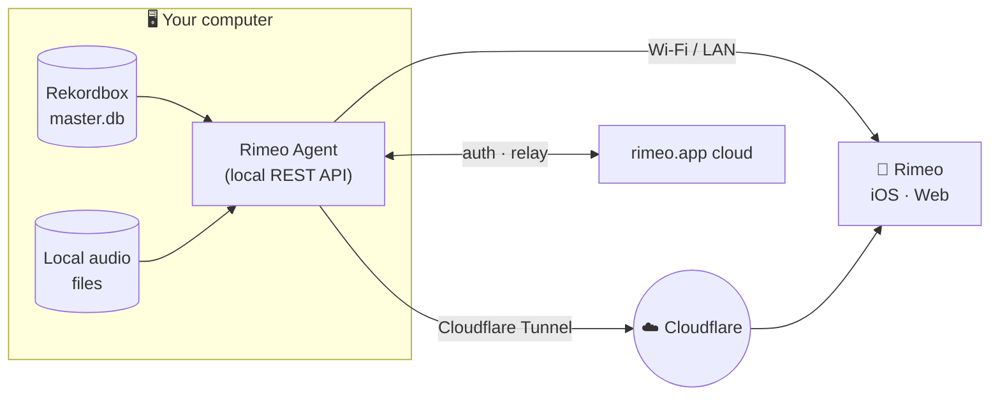

<div align="center">

# Rimeo Agent

### Turn the DJ library on your computer into a private streaming server.

Native **macOS** & **Windows** companion apps that securely expose your **Rekordbox** library to the Rimeo iOS and web players — on your local network, or from anywhere via Cloudflare Tunnel. Your files never leave your machine.

[](https://github.com/ilokhrimenko-lab/rimeo-agent/actions/workflows/build.yml)
[](https://github.com/ilokhrimenko-lab/rimeo-agent/releases)


**[⬇️ Download](https://rimeo.app/open)** · **[Releases](https://github.com/ilokhrimenko-lab/rimeo-agent/releases)** · **[rimeo.app](https://rimeo.app)**

</div>

---

## Overview

**Rimeo Agent** runs on the computer that holds your music. It reads your existing **Rekordbox** database — no re-import, no re-tagging — serves your tracks and waveforms through a local REST API, and lets the Rimeo app stream them: at home on the same Wi‑Fi, or remotely through an auto‑provisioned Cloudflare Tunnel.

Everything stays on your machine. Audio is streamed straight from your drive, and every request is authenticated against your Rimeo account — only you can reach your library.

## Features

- 🎚️ **Reads Rekordbox directly** — decrypts the encrypted Rekordbox `master.db` (SQLCipher) and mirrors your playlists, hot cues, ratings, BPM/key and metadata. Zero import step.
- 🔊 **Stream & transcode on the fly** — HTTP range‑request streaming with ffmpeg transcoding and pre‑rendered waveforms for instant scrubbing.
- 🌐 **Play from anywhere** — one‑click **Cloudflare Tunnel** provisioning for secure remote access; **Bonjour / mDNS** for zero‑config discovery on the LAN.
- 🔐 **Private & account‑bound** — single‑session login tied to your Rimeo cloud account, JWT‑verified on every call. Files never leave the host.
- 🧠 **Analysis & similarity** — background audio analysis powers "find similar tracks" suggestions.
- ♻️ **Silent auto‑update** — checks GitHub Releases, stages the new build and applies it on the next launch.
- 🧩 **Self‑provisioning runtime** — fetches its own helper binaries (`cloudflared`, `ffmpeg`) on first launch. Nothing to install by hand.

## How it works



1. The agent opens the Rekordbox library and mirrors it into a fast in‑memory index.
2. A local HTTP server exposes endpoints such as `/api/data`, `/stream`, `/waveform`, plus tunnel and account controls.
3. The Rimeo player finds the agent on the LAN, or connects through the Cloudflare Tunnel when you're away.
4. Audio is streamed on demand, transcoded as needed — your collection stays on your disk.

## Repository layout

| Path | Platform | Stack |
|------|----------|-------|
| [`macos_arm64/`](macos_arm64) | macOS 12+ — Universal (Apple Silicon + Intel) | Swift 6 toolchain · SwiftPM · SQLCipher · sandboxed `RekordboxDBHelper` |
| [`windows_csharp/`](windows_csharp) | Windows 10/11 — x64 + arm64 | C# / .NET 8 · WinUI 3 · NSIS installer |
| [`.github/workflows/build.yml`](.github/workflows/build.yml) | CI | Build · code‑sign · notarize · package · publish to Releases |
| `build_info.py`, `similarity_config.json`, `rimeo1024*.{png,icns}` | — | Build metadata, analysis config and app icons consumed by CI |

Both agents are feature‑parallel — each ships a local HTTP server, an audio/streaming service, a Cloudflare tunnel manager, a runtime component manager, an analysis/similarity engine, and a GitHub‑Releases auto‑updater.

## Building & releasing

Builds run in **GitHub Actions** and are triggered by pushing a tag:

| Tag | Builds |
|-----|--------|
| `v1.0-buildNNN` | macOS **+** Windows |
| `mac-v1.0-buildNNN` | macOS only |
| `win-v1.0-buildNNN` | Windows only |

Pushing a build is always **two** steps — commit **and** tag. Without the tag the workflow never starts:

```bash
# 1. bump build_info.py (VERSION, BUILD_NUMBER, RELEASE_TAG)
git commit -am "Build NNN"
git tag mac-v1.0-buildNNN && git push origin main && git push origin mac-v1.0-buildNNN
# or simply: ./release_mac.sh   (does the bump, commit, tag and push for you)
```

CI produces a Developer‑ID‑signed, **notarized** macOS `.app` and **NSIS** installers for Windows x64 & arm64, then attaches all artifacts to a GitHub Release.

Every macOS release carries **two** assets — shipping only one of them is a bug:

| Asset | Why it must be there |
|-------|----------------------|
| `RimeoAgent.dmg` | What a human downloads: mount, drag **RimeoAgent** to Applications. |
| `RimeoAgent_mac.zip` | The auto‑update channel. Its filename is hard‑coded in `UpdateChecker.swift` — rename it or drop it from a release and self‑update dies **silently** on every installed agent. |

The `.dmg` is built by [`packaging/dmg/make_dmg.sh`](packaging/dmg) — `dmgbuild`, fully headless (no Finder, no AppleScript: Finder snaps icons to its own grid and isn't available on a CI runner). Its window background comes from `background.png` + `background@2x.png`, merged into a `.tiff` so it stays crisp on Retina. The image is signed and **notarized separately from the `.app`** — a stapled app inside a non‑notarized disk image still trips Gatekeeper.

Build the macOS agent locally:

```bash
cd macos_arm64
swift build -c release --arch arm64 --arch x86_64
# or run the full packaging script:
./release_mac.sh
```

## Download & updates

End users get the correct installer automatically at **[rimeo.app/open](https://rimeo.app/open)**, which serves the latest [GitHub Release](https://github.com/ilokhrimenko-lab/rimeo-agent/releases). Installed agents keep themselves current from that same Releases feed — no manual upgrades.

## Security model & trust boundaries

The agent runs a local HTTP server that can read files from your machine, so access is gated defensively (fail‑closed — an unknown or misconfigured state denies rather than grants):

- **Authentication.** Data endpoints (`/stream`, `/waveform`, `/artwork`, `/api/data`, `/api/logs`) and every mutating/control endpoint (`/api/link_account`, `/api/tunnel/*`, `/reveal`, notes, …) require either a per‑device **LAN pre‑shared key** (exchanged in the pairing QR) or a valid server‑signed **ES256 JWT** (issued only over the provisioned named tunnel). With neither a PSK nor a named tunnel, requests are **refused**. The agent's own desktop UI is trusted in‑process and never crosses the socket.
- **File access is library‑scoped.** File‑serving endpoints canonicalize the requested path (resolving `..` and symlinks) and serve it only if it lives inside a **library directory** (a folder that holds your tracks, the agent's cache, or the Rekordbox share folder). Arbitrary paths — `~/.ssh/id_rsa`, `/etc/passwd`, traversal, symlink escapes — are rejected with `403`.
- **CORS is allow‑listed.** Only the Rimeo web player origin may read responses cross‑origin; there is no wildcard `Access-Control-Allow-Origin: *`, which blocks browser drive‑by requests from other sites.
- **Signed auto‑updates.** On macOS an update is applied only after its `.app` is verified as **Developer‑ID signed by the Rimeo team** (`codesign` + Team ID) — a compromised release cannot ship our signature.
- **Pinned helper downloads.** `cloudflared` / `ffmpeg` are fetched only from Rimeo‑controlled hosts (rimeo.app / GitHub releases) and checksum‑verified before execution.
- **Cloud relay.** When you're away, the rimeo.app cloud relays requests to the agent over a long‑poll channel. The cloud is a trusted first‑party component and signs its own JWT, so relayed requests clear authentication by design; their file reach is nonetheless **bounded by the library‑scoping above** — a relayed request can never read files outside your library.

## License

© Rimeo. All rights reserved. This source is published for transparency and distribution; it is **not** open‑source and may not be reused, redistributed or modified without prior written permission.
